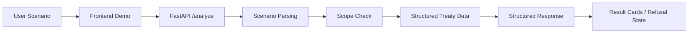

# Tax Treaty Agent

A bounded AI tool that turns a cross-border tax scenario into a structured treaty analysis.


## Why This Project Exists

Most AI tax demos stop at a generic chat box. This project takes a different approach:

- narrow scope over fake breadth
- treaty-backed output over free-form guesswork
- explicit refusal behavior over overconfident hallucination
- productized workflow over prompt-only demos

The current MVP is built to show how international tax business logic can be translated into a usable AI system.

## What The MVP Supports

Current scope:

- country pair: `China <-> Netherlands`
- transaction types: `dividends`, `interest`, `royalties`
- interaction mode: single-turn natural language input
- output mode: structured analysis

Current output includes:

- treaty article
- treaty rate
- flow direction
- conditions
- notes
- human review guidance

Current refusal behavior includes:

- incomplete scenario
- unsupported country pair
- unsupported transaction type

## Example Scenarios

Supported:

- `中国居民企业向荷兰支付特许权使用费`
- `中国公司向荷兰公司支付股息`
- `荷兰公司向中国母公司支付股息`
- `中国企业向荷兰银行支付贷款利息`

Rejected by design:

- `中国居民企业向美国支付特许权使用费`
- `中国居民企业向荷兰支付服务费`
- `向荷兰公司支付股息`

## System Shape



Design intent:

- frontend provides a clear demo surface
- backend controls parsing and guardrails
- treaty facts stay in structured data
- unsupported cases fail conservatively

## Repository Structure

```text
backend/   FastAPI app and tests
frontend/  React + Vite demo shell
data/      Seed treaty data
docs/      Design docs, plans, assets
.codex/    Project memory and status
```

## Local Run

### 1. Backend

From the repo root:

```powershell
.\.venv\Scripts\python -m uvicorn app.main:app --host 127.0.0.1 --port 8000 --app-dir backend
```

### 2. Frontend

In a second terminal:

```powershell
cd frontend
npm install
npm run dev -- --host 127.0.0.1 --port 4173
```

Then open:

`http://127.0.0.1:4173`

The Vite dev server proxies `/api` to the local FastAPI backend.

## Verification

Backend tests:

```powershell
.\.venv\Scripts\python -m pytest backend/tests/test_analyze.py
```

Frontend tests:

```powershell
cd frontend
npm test
```

Frontend build:

```powershell
cd frontend
npm run build
```

## Current State

Already working:

- design spec and implementation plan
- backend MVP with direction-aware parsing
- structured treaty-backed outputs
- conservative refusal behavior
- frontend demo shell for GitHub-style presentation
- local browser demo verified

## Roadmap

Near-term next steps:

- improve unsupported / incomplete UX states
- add stronger README storytelling and demo assets
- expand structured treaty examples

Future directions:

- richer treaty coverage
- more robust parsing
- source-document processing
- retrieval upgrades beyond seed JSON

## Key Docs

- `docs/superpowers/specs/2026-03-11-tax-treaty-agent-design.md`
- `docs/superpowers/plans/2026-03-11-tax-treaty-agent-implementation-plan.md`
- `.codex/project-memory.md`
- `.codex/project-status.md`
