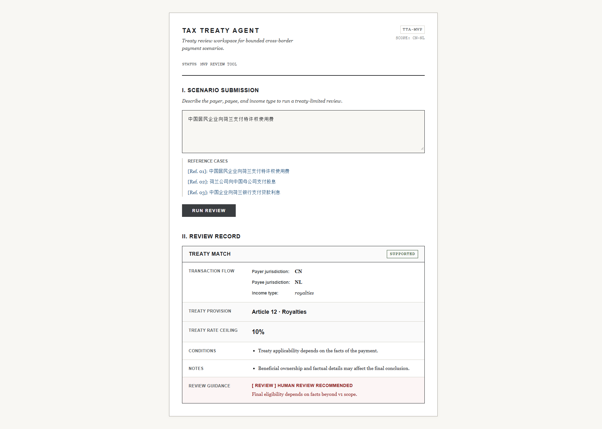
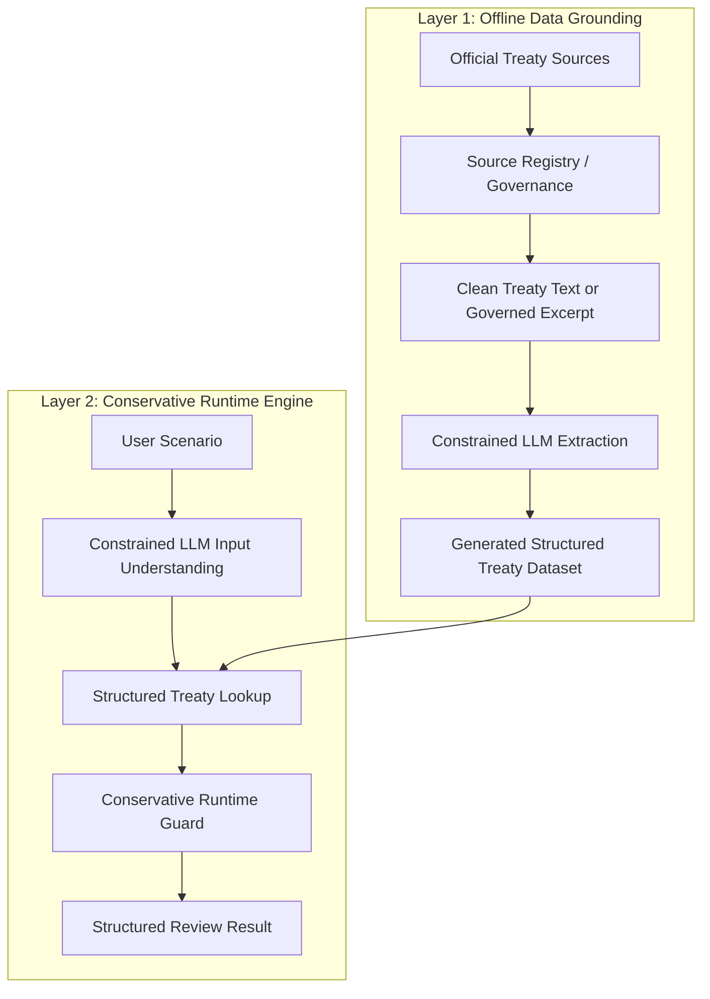

# Tax Treaty Agent

A bounded, source-aware international tax treaty pre-review system that uses AI in tightly controlled places while keeping treaty facts inside structured data and conservative runtime guardrails.



## What This Project Is

`Tax Treaty Agent` is a bounded international tax treaty pre-review tool.

It is built for a narrow but real workflow:

- a user describes a cross-border payment scenario
- the system identifies the likely treaty lane
- the system returns a structured first-pass review
- the system refuses to sound certain when key facts are missing

This project is intentionally **not**:

- a generic tax chatbot
- a final legal or tax opinion engine
- a free-form LLM that invents treaty outcomes from memory

## Why This Project Exists

Many AI tax demos look polished but rely on free-form model output, vague scope, and weak trust boundaries.

This project takes the opposite path:

- narrow scope over fake breadth
- structured treaty facts over model memory
- explicit refusal behavior over confident guessing
- product workflow over prompt-only demo behavior

The goal is to show how a high-risk business problem can be turned into a credible AI system **without pretending the model is allowed to decide legal facts on its own**.

## What It Does Today

The current version can help a user:

- determine whether a scenario is inside the supported treaty boundary
- locate the likely treaty article and likely rate ceiling
- surface source anchors and extraction-quality signals
- separate routine review from priority review and no-auto-conclusion states
- explain what facts are still missing before a stronger answer is possible

## System Architecture

The project is easiest to understand as a two-layer system:



This is the core idea of the project:

- AI may help interpret inputs and extract structured document data
- treaty facts still live in structured datasets
- runtime guardrails decide when the system must slow down, escalate, or refuse

## Why This Is Not A Chatbot

This repo does use LLMs, but only inside narrow, reviewable roles.

At runtime:

- the model may help interpret a natural-language scenario
- the model does **not** decide treaty rates from memory

Offline:

- the model may help extract article / paragraph / rule structure from treaty text
- the model does **not** become the final legal source of truth by itself

That distinction is the point of the project.

## How Trust Is Handled

The trust model is intentionally strict:

- treaty facts come from structured treaty data, not runtime model recall
- source anchors and provenance survive into the user-facing result
- source governance is explicit instead of hand-waved
- low-confidence or branch-ambiguous cases escalate conservatively
- unsupported or incomplete scenarios are refused instead of guessed

In short: the system tries to be useful without pretending to be authoritative beyond its boundary.

## Current Scope

Supported today:

- country pair: `China <-> Netherlands`
- transaction types: `dividends`, `interest`, `royalties`
- interaction mode: single-turn natural language input
- output mode: structured analysis

Structured output includes:

- treaty article
- source anchor
- source quality
- treaty excerpt
- treaty rate
- flow direction
- conditions
- notes
- human review guidance

Conservative refusal behavior includes:

- incomplete scenario
- unsupported country pair
- unsupported transaction type

## Example Scenarios

Supported:

- `中国居民企业向荷兰支付特许权使用费`
- `中国公司向荷兰公司支付股息`
- `荷兰公司向中国母公司支付股息`
- `中国企业向荷兰银行支付贷款利息`

Rejected by design:

- `中国居民企业向美国支付特许权使用费`
- `中国居民企业向荷兰支付服务费`
- `向荷兰公司支付股息`

## Why The Scope Is Narrow

The narrow scope is intentional.

This project is trying to prove:

- the system boundary is real
- the treaty data model is real
- the review guidance is real
- the refusal behavior is real

That is more valuable than pretending to cover many countries or many tax topics with weak trust controls.

## Strongest Current Proof Point

The current strongest Phase 2 proof is the `Article 10` dividend branch case.

That proof matters because it demonstrates a hard situation:

- offline constrained LLM extraction can produce a structured dataset from treaty text
- the generated dataset can contain multiple credible rate branches such as `5%` and `10%`
- runtime can consume that generated dataset through the explicit `llm_generated` lane
- if the user has not supplied the ownership facts needed to choose a branch, runtime does **not** silently pick one
- instead, it escalates to `no auto conclusion` and surfaces `alternative_rate_candidates`

That is much closer to a real bounded professional tool than a smooth-looking answer demo.

## Proof Case Walkthrough

Here is the shortest useful example of why this architecture matters.

### Step 1: Start from treaty text

The project takes a governed Article 10 dividend excerpt in which the treaty text contains two possible source-state rate branches:

- `5%`
- `10%`

### Step 2: Run constrained offline extraction

The offline extraction lane turns that text into a structured dataset with:

- one article
- one paragraph
- multiple rate-bearing candidate rules
- source anchors and extraction metadata

### Step 3: Feed the generated dataset into the same runtime engine

The runtime can explicitly switch from the stable curated dataset to the `llm_generated` dataset without changing the product contract.

### Step 4: Refuse false certainty

If the user input is only:

`中国公司向荷兰公司支付股息`

then the runtime still does **not** know whether the ownership threshold for the reduced branch is satisfied.

So the system does **not** silently pick `5%` or `10%`.

Instead, it:

- enters `no auto conclusion`
- surfaces `alternative_rate_candidates`
- shows multiple possible treaty rates
- keeps the final branch choice for human review

That is the kind of bounded AI behavior this repo is trying to prove.

## Source Governance

One of the hardest problems in treaty systems is not the UI. It is the source layer:

- where the treaty text came from
- whether it is official
- whether it is the main treaty text or an MLI / metadata context text
- which repo artifacts derive from which official sources

The repo now includes a formal China-Netherlands source-governance package:

- official source registry
- source usage map
- source-aware ingest validation

This means the project no longer treats “treaty text” as one vague blob. It can increasingly say which governed official source a given ingest path or artifact derives from.

## Repository Structure

```text
backend/   FastAPI app and tests
frontend/  React + Vite demo shell
data/      Seed treaty data
  source_documents/  source-aligned import fixtures
scripts/   dataset builders and future ingestion helpers
docs/      Design docs, plans, assets
.codex/    Project memory and status
```

`data/source_documents/` now uses a parser-like intermediate format instead of a flat answer list, so the import path is closer to a future real treaty parser.
That intermediate layer now also preserves basic parser metadata such as source language and extraction confidence.

## Current State

Already working:

- runtime: constrained LLM input understanding with conservative refusal behavior
- runtime: stable curated dataset as default, plus an explicit `llm_generated` side lane
- runtime: branch ambiguity escalates to `no auto conclusion` instead of silent overconfidence
- data layer: article / paragraph / rule treaty schema with source anchors and provenance
- Phase 2: constrained offline LLM extraction from clean treaty text into generated structured datasets
- source governance: official China-Netherlands registry plus source-aware ingest validation
- frontend: one-screen demo that exposes structured review results instead of chatty free-form output

Current public identity:

- a cross-border payment treaty pre-review tool
- bounded, explainable, and source-aware
- not a final opinion engine
- default runtime stays on the stable curated dataset, while a controlled `llm_generated` data-source path exists for Phase 2 validation

## Run Locally

### 1. Backend

From the repo root:

```powershell
.\.venv\Scripts\python -m uvicorn app.main:app --host 127.0.0.1 --port 8000 --app-dir backend
```

### 2. Frontend

In a second terminal:

```powershell
cd frontend
npm install
npm run dev -- --host 127.0.0.1 --port 4173
```

Then open:

`http://127.0.0.1:4173`

The Vite dev server proxies `/api` to the local FastAPI backend.

## Verification

Backend tests:

```powershell
.\.venv\Scripts\python -m pytest backend/tests/test_analyze.py
```

Frontend tests:

```powershell
cd frontend
npm test
```

Frontend build:

```powershell
cd frontend
npm run build
```

Run a live LLM input-understanding smoke check:

```powershell
.\.venv\Scripts\python scripts/run_llm_input_smoke.py --scenario "我是北京的独立开发者，把软件授权给阿姆斯特丹的公司"
```

Run the first Phase 2 LLM document-ingest path:

```powershell
.\.venv\Scripts\python scripts/ingest_cn_nl_llm_text.py
```

Run the API against the LLM-generated dataset without changing the default demo path:

```powershell
@'
{
  "scenario": "中国居民企业向荷兰支付特许权使用费",
  "data_source": "llm_generated"
}
'@ | curl.exe -X POST http://127.0.0.1:8000/analyze -H "Content-Type: application/json" --data-binary @-
```

Rebuild generated treaty dataset:

```powershell
.\.venv\Scripts\python scripts/build_cn_nl_dataset.py --output data/treaties/cn-nl.v3.generated.json
```

## Roadmap

### Phase 1

Constrained runtime input understanding:

- LLM helps read natural-language scenarios
- runtime still routes into structured treaty lookup
- bad or unsupported inputs fail conservatively

### Phase 2

Real document-to-structured-data generation:

- clean treaty text enters the offline extraction lane
- constrained LLM extraction produces parser-like source payloads
- generated datasets can feed the same conservative runtime engine

### Later, only if needed

- dynamic review guidance
- additional country pairs
- broader source ingestion surface

## Key Docs

- `docs/superpowers/specs/2026-03-11-tax-treaty-agent-design.md`
- `docs/superpowers/specs/2026-03-11-tax-treaty-agent-alignment-roadmap-design.md`
- `docs/superpowers/specs/2026-03-11-tax-treaty-agent-import-stub-design.md`
- `docs/superpowers/plans/2026-03-11-tax-treaty-agent-implementation-plan.md`
- `docs/superpowers/plans/2026-03-11-tax-treaty-agent-phase-a-checklist.md`
- `.codex/project-memory.md`
- `.codex/project-status.md`
