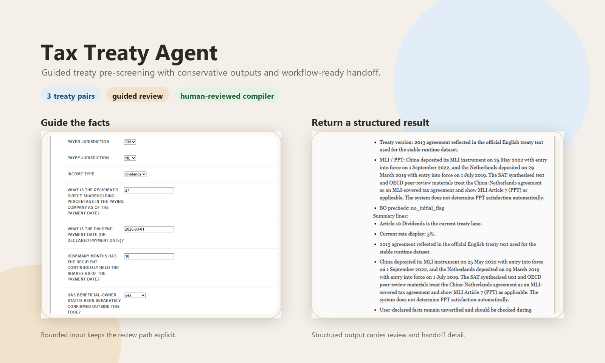
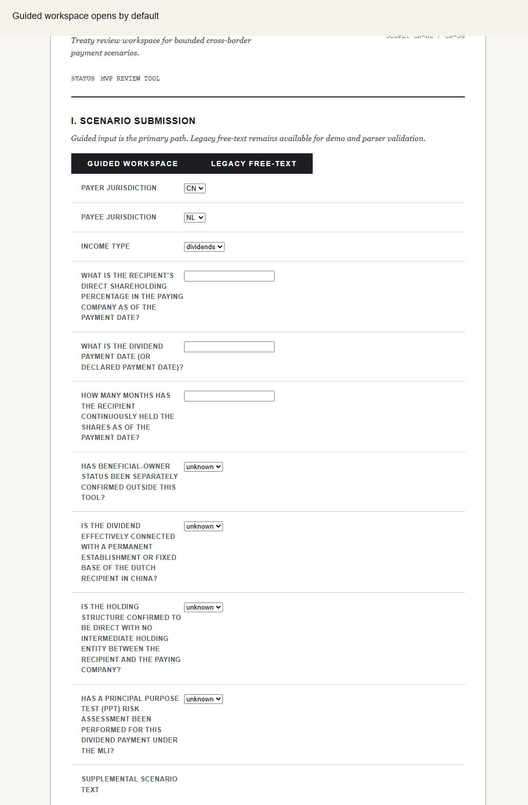

# Tax Treaty Agent

面向跨境支付场景的税收协定适用性预审工具。当前支持中荷、中新、中韩协定下的股息、利息及特许权使用费场景，使用结构化协定数据与保守规则引擎输出可追溯、可交接的预审结果。

An international tax treaty pre-screening tool for cross-border payment scenarios. It currently supports China–Netherlands, China–Singapore, and China–Korea dividend, interest, and royalty lanes using structured treaty data, conservative rule logic, and workflow-ready handoff output.



[Watch extended guided demo (26s)](assets/tax-treaty-agent-guided-demo-extended.gif)



## Quick Proof / 快速验证

### 中文

1. 启动后端：

   ```powershell
   .\.venv\Scripts\python -m uvicorn app.main:app --host 127.0.0.1 --port 8000 --app-dir backend
   ```

2. 启动前端：

   ```powershell
   cd frontend
   npm install
   npm run dev -- --host 127.0.0.1 --port 4173
   ```

3. 运行公开 smoke proof：

   ```powershell
   python scripts/run_public_smoke.py
   ```

4. 打开 `http://127.0.0.1:4173`，默认看到 guided workspace；按 GIF 中的路径填写一条 `CN -> NL dividends` 场景，可得到结构化结果、workflow handoff 和 review signals。

预期观察结果：
- smoke script 返回 `2/2 checks passed`
- guided dividend 示例返回 `Article 10`、`5%`、`standard_review`
- out-of-scope 示例返回 `unsupported_country_pair`

### English

1. Start the backend:

   ```powershell
   .\.venv\Scripts\python -m uvicorn app.main:app --host 127.0.0.1 --port 8000 --app-dir backend
   ```

2. Start the frontend:

   ```powershell
   cd frontend
   npm install
   npm run dev -- --host 127.0.0.1 --port 4173
   ```

3. Run the public smoke proof:

   ```powershell
   python scripts/run_public_smoke.py
   ```

4. Open `http://127.0.0.1:4173`. The app opens in the guided workspace by default; following the GIF flow with a `CN -> NL dividends` case returns a structured result, workflow handoff, and review signals.

Expected outcome:
- the smoke script returns `2/2 checks passed`
- the guided dividend example returns `Article 10`, `5%`, and `standard_review`
- the out-of-scope example returns `unsupported_country_pair`

## Current Coverage / 当前支持范围

| Treaty Pair | Income Types |
|---|---|
| China – Korea | Dividends, Interest, Royalties |
| China – Netherlands | Dividends, Interest, Royalties |
| China – Singapore | Dividends, Interest, Royalties |

当前支持范围是刻意收窄的。对外部访客来说，这个项目要证明的是“高风险税务问题可以被做成可信的 AI 工具”，而不是“随意扩国家和收入类型”。

Coverage is intentionally narrow. The point of the project is not broad treaty count; it is to show that a high-risk tax problem can be turned into a credible, bounded AI workflow.

## Why This Is Credible / 为什么可信

### 中文

- **Source-anchored treaty data**：税率、条款和 working-paper 引用都来自结构化协定数据，不依赖 runtime 模型记忆。
- **Conservative refusal**：关键事实缺失时终止，而不是猜测；超范围场景返回明确拒绝。
- **Wizard-first guided input**：主要路径是按收入类型收集事实，而不是自由聊天。
- **Workflow-ready handoff**：输出不仅给出初步结论，还提供 machine-readable handoff、BO precheck、conflict / review signals。

### English

- **Source-anchored treaty data**: treaty rates, article references, and working-paper links come from structured datasets rather than runtime model recall.
- **Conservative refusal**: the system terminates on missing critical facts and rejects unsupported scope explicitly instead of guessing.
- **Wizard-first guided input**: the primary path is a type-specific fact collection flow, not open-ended chat.
- **Workflow-ready handoff**: outputs include machine-readable handoff payloads, BO precheck, and review/conflict signals instead of a bare answer.

## Known Limits / 当前边界

### 中文

- 这不是最终税务意见，也不替代律师、税务顾问或内部复核。
- `MLI/PPT` 当前只作为 **review signal** 暴露，不在 runtime 中自动作出实体性 override 判断。
- free-text 仍保留，但只是 legacy/demo 兼容路径；主路径是 guided input。
- 不支持当前范围之外的国家对、收入类型或开放式税务问答。

### English

- This is not a final tax opinion and does not replace legal, tax, or internal review.
- `MLI/PPT` is currently exposed as a **review signal only**; the runtime does not attempt a substantive treaty override determination.
- Free-text remains available as a legacy/demo compatibility lane; guided input is the primary path.
- Unsupported treaty pairs, income types, and open-ended tax questions are intentionally rejected.

## Running Locally / 本地运行

### Backend
```powershell
.\.venv\Scripts\python -m uvicorn app.main:app --host 127.0.0.1 --port 8000 --app-dir backend
```

### Frontend
```powershell
cd frontend
npm install
npm run dev -- --host 127.0.0.1 --port 4173
```

Then open:

`http://127.0.0.1:4173`

The Vite dev server proxies `/api` to the local FastAPI backend.

## Internal Docs Note / 内部文档说明

中文：仓库中保留了 `docs/superpowers` 目录，用于内部执行控制、证据包、研究记录和 gate review 产物。这些材料有助于审计和开发过程，但**不是**运行或评估公开 demo 的前置条件。

English: The repo keeps `docs/superpowers` as an internal execution, evidence, research, and gate-review archive. Those materials support auditability and project discipline, but they are **not required** to run or evaluate the public demo.
