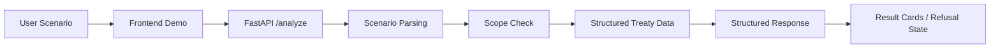

# Tax Treaty Agent

A bounded tax treaty review tool that helps users run a first-pass, source-aware analysis of cross-border payment scenarios using structured treaty data and explicit review guidance.


## What This Is

`Tax Treaty Agent` is a cross-border payment treaty pre-review tool prototype.

It is designed to answer a narrow but real question:

- for a given cross-border payment scenario, which treaty article is likely relevant
- what is the likely rate ceiling
- what conditions and caveats matter
- when should a human reviewer step in

The project is intentionally built as a bounded professional tool, not a generic tax chatbot and not a final legal or tax opinion engine.

## Why This Project Exists

Many AI tax demos look impressive on the surface but rely on free-form model output, vague scope, and weak trust boundaries.

This project takes a different approach:

- narrow scope over fake breadth
- treaty-backed output over free-form guesswork
- explicit refusal behavior over overconfident hallucination
- productized workflow over prompt-only demos

The current MVP is built to show how a complex business problem can be turned into a credible AI tool without pretending the system is more reliable than it is.

## What It Does

The current version helps users:

- identify whether a scenario falls within the supported treaty scope
- locate the likely treaty article and rate ceiling
- see source-aware review signals
- understand when human review should be prioritized

## Why Not A Chatbot

This project is deliberately not positioned as an open-ended conversational tax assistant.

Reasons:

- tax treaty outcomes should not be invented from model memory
- supported and unsupported boundaries should be explicit
- high-risk ambiguity should lead to review guidance, not fake certainty
- a tool feels more credible when its scope is clear

The goal is first-pass pre-review, not broad legal reasoning across unlimited tax questions.

## How Trust Is Handled

The trust model is simple and intentional:

- treaty facts come from structured treaty data, not free-form model recall
- results include source anchors so the output is traceable
- source quality metadata is preserved through the data pipeline
- low-confidence extraction triggers stronger review priority
- unsupported or incomplete cases are refused conservatively

In other words, the system tries to be useful without pretending to be authoritative beyond its boundary.

## Current Scope

Supported today:

- country pair: `China <-> Netherlands`
- transaction types: `dividends`, `interest`, `royalties`
- interaction mode: single-turn natural language input
- output mode: structured analysis

Structured output includes:

- treaty article
- source anchor
- source quality
- treaty excerpt
- treaty rate
- flow direction
- conditions
- notes
- human review guidance

Conservative refusal behavior includes:

- incomplete scenario
- unsupported country pair
- unsupported transaction type

## Example Scenarios

Supported:

- `中国居民企业向荷兰支付特许权使用费`
- `中国公司向荷兰公司支付股息`
- `荷兰公司向中国母公司支付股息`
- `中国企业向荷兰银行支付贷款利息`

Rejected by design:

- `中国居民企业向美国支付特许权使用费`
- `中国居民企业向荷兰支付服务费`
- `向荷兰公司支付股息`

## Why The Scope Is Narrow

The narrow scope is intentional.

This project is trying to prove:

- the system boundary is real
- the treaty data model is real
- the review guidance is real
- the refusal behavior is real

That is more valuable than pretending to cover many countries or many tax topics with weak trust controls.

## System Shape



Design intent:

- frontend provides a clear demo surface
- backend controls parsing and guardrails
- treaty facts stay in structured data
- unsupported cases fail conservatively
- the product behaves like a bounded pre-review tool, not an open-ended advisor

## Why This Is An AI Project

The project does not treat AI as permission to guess.

Instead, it treats AI as one layer inside a controlled system:

- AI-related parsing and extraction can help interpret inputs and documents
- structured treaty data holds the legal facts
- confidence and review signals control how cautious the product should be

That combination is the point: not just "AI that answers," but AI inside a system with boundaries.

## Repository Structure

```text
backend/   FastAPI app and tests
frontend/  React + Vite demo shell
data/      Seed treaty data
  source_documents/  source-aligned import fixtures
scripts/   dataset builders and future ingestion helpers
docs/      Design docs, plans, assets
.codex/    Project memory and status
```

`data/source_documents/` now uses a parser-like intermediate format instead of a flat answer list, so the import path is closer to a future real treaty parser.
That intermediate layer now also preserves basic parser metadata such as source language and extraction confidence.

## Current State

Already working:

- backend MVP with direction-aware parsing
- structured treaty-backed outputs
- source anchors and source quality signals
- first `source_documents + import stub` path into a generated v3 dataset
- parser-like source fixtures flowing through `parsed_articles -> paragraphs -> extracted_rules`
- low-confidence extractions escalating to stronger review priority
- conservative refusal behavior
- one-screen frontend demo for public presentation

Current public identity:

- a cross-border payment treaty pre-review tool
- bounded, explainable, and source-aware
- not a final opinion engine
- default runtime stays on the stable curated dataset, while a controlled `llm_generated` data-source path exists for Phase 2 validation

## Run Locally

### 1. Backend

From the repo root:

```powershell
.\.venv\Scripts\python -m uvicorn app.main:app --host 127.0.0.1 --port 8000 --app-dir backend
```

### 2. Frontend

In a second terminal:

```powershell
cd frontend
npm install
npm run dev -- --host 127.0.0.1 --port 4173
```

Then open:

`http://127.0.0.1:4173`

The Vite dev server proxies `/api` to the local FastAPI backend.

## Verification

Backend tests:

```powershell
.\.venv\Scripts\python -m pytest backend/tests/test_analyze.py
```

Frontend tests:

```powershell
cd frontend
npm test
```

Frontend build:

```powershell
cd frontend
npm run build
```

Run a live LLM input-understanding smoke check:

```powershell
.\.venv\Scripts\python scripts/run_llm_input_smoke.py --scenario "我是北京的独立开发者，把软件授权给阿姆斯特丹的公司"
```

Run the first Phase 2 LLM document-ingest path:

```powershell
.\.venv\Scripts\python scripts/ingest_cn_nl_llm_text.py
```

Run the API against the LLM-generated dataset without changing the default demo path:

```powershell
@'
{
  "scenario": "中国居民企业向荷兰支付特许权使用费",
  "data_source": "llm_generated"
}
'@ | curl.exe -X POST http://127.0.0.1:8000/analyze -H "Content-Type: application/json" --data-binary @-
```

Rebuild generated treaty dataset:

```powershell
.\.venv\Scripts\python scripts/build_cn_nl_dataset.py --output data/treaties/cn-nl.v3.generated.json
```

## Roadmap

### Phase A

Turn the repo into a polished, GitHub-strong version of the current product:

- stronger README and project story
- clearer trust communication
- better examples, screenshots, and demo polish
- tighter consistency across docs, UI, and behavior

### Phase B

Evolve the system into a real-document-driven demo:

- real document acquisition path
- stronger extraction workflow
- richer validation and fallback behavior
- continued source traceability

### Phase C

Only after that, evaluate whether a narrow trial-tool path makes sense:

- stronger maintenance assumptions
- stronger review workflows
- clearer real-world usage boundaries

## Key Docs

- `docs/superpowers/specs/2026-03-11-tax-treaty-agent-design.md`
- `docs/superpowers/specs/2026-03-11-tax-treaty-agent-alignment-roadmap-design.md`
- `docs/superpowers/specs/2026-03-11-tax-treaty-agent-import-stub-design.md`
- `docs/superpowers/plans/2026-03-11-tax-treaty-agent-implementation-plan.md`
- `docs/superpowers/plans/2026-03-11-tax-treaty-agent-phase-a-checklist.md`
- `.codex/project-memory.md`
- `.codex/project-status.md`
