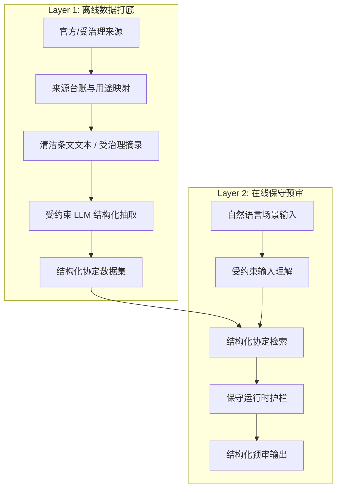

# Tax Treaty Agent 产品白皮书

**版本：** v1.0
**日期：** 2026-03-12
**文档状态：** 对外发布版
**项目名称：** Tax Treaty Agent

---

## 1. 摘要

`Tax Treaty Agent` 是一款面向跨境支付场景的**国际税收协定预审工具**。它的设计目标既非替代税务顾问，也非将复杂的协定判断简单包装为聊天问答——而是在一个**严格收敛的业务边界**内，帮助用户更快进入正确的协定分析路径，并在事实不充分时果断停下。

项目当前聚焦于 **中国 ↔ 荷兰** 双边税收协定，覆盖 **股息（Dividends）**、**利息（Interest）**、**特许权使用费（Royalties）** 三类被动收入，采用**单轮自然语言输入 + 结构化输出**的交互模式。系统基于 **"离线数据打底 + 在线保守预审"** 的双层架构，将大语言模型严格限制在输入理解与离线结构化抽取等可审计、可约束的环节，同时将协定事实、税率候选、来源锚点与人工复核提示保留在结构化数据与运行时护栏之内。

本白皮书旨在完整阐述该产品所解决的问题、系统边界、架构设计、信任机制、当前进展与未来路线——展示一个高风险专业问题如何被构造为**可信、可解释、可扩展**的 AI 工具，而非一个表面流畅却缺乏事实边界的演示型对话产品。

---

## 2. 行业背景与问题定义

### 2.1 业务背景

在跨境支付场景中，企业或顾问团队面临的首要挑战往往不是"得出最终税务结论"，而是一系列更前置的路径判断问题：

- 当前交易大概率对应哪一条协定条款？
- 协定税率上限可能落在哪个区间？
- 还缺少哪些关键事实才能进一步推进分析？
- 当前已有材料是否足以支撑下一步工作？
- 什么情形下应当升级为人工重点复核？

这类判断天然具有**高风险、强规则、强来源依赖**的特征。一个系统如果在事实不充分时仍给出过度确定的结论，所制造的业务成本可能远高于"没有答案"本身。

### 2.2 传统 AI 路径的不足

现有的 AI 税务概念验证系统普遍存在三类问题：

| 问题类型 | 具体表现 |
|---------|---------|
| **事实边界缺失** | 依赖模型记忆直接生成税务结论，无结构化事实约束 |
| **产品边界模糊** | 将预审、检索、判断、结论混为一体，职责不清 |
| **保守机制缺位** | 对超范围或信息缺失场景缺乏主动拒绝能力 |

对于税收协定分析而言，系统真正的难点不在于让模型"看起来聪明"，而在于**如何让它在有帮助的同时不越界**。

### 2.3 本项目要解决的核心问题

> 在一个有限但真实的跨境支付工作流中，用结构化数据、可追溯来源和保守运行时护栏，将用户快速引导至正确的协定分析框架，并在不确定时**主动暴露不确定性**。

---

## 3. 产品定位

### 3.1 产品定义

`Tax Treaty Agent` 是一个**有明确边界的税收协定第一轮预审工具**。它服务于"先判断协定分析路径是否成立、应关注哪条条款、下一步应核查什么"的前置工作环节，而非出具最终税务意见的终局系统。

### 3.2 核心产品特征

- **有边界** — 仅处理明确支持范围内的问题，超出即拒绝
- **重来源** — 结论依赖结构化协定数据与来源锚点，而非模型记忆
- **偏保守** — 事实不充分时拒绝伪装确定性
- **可解释** — 结果以结构化方式呈现条款、税率、条件、注意事项与复核建议
- **可扩展** — 前端与 API 契约保持稳定，允许数据层独立迭代升级

### 3.3 明确的非目标

本产品当前**不追求**以下定位：

- ❌ 通用税务聊天机器人
- ❌ 最终法律或税务意见出具系统
- ❌ 任意国家、任意税种、任意材料的一站式处理平台
- ❌ 运行时依赖大模型直接判断协定适用结果的黑盒系统

---

## 4. 当前适用范围

为确保可信度与交付质量，v1 阶段**刻意收窄**适用范围：

| 维度 | 当前范围 |
|------|---------|
| **国家对** | 中国 ↔ 荷兰 |
| **收入类型** | 股息、利息、特许权使用费 |
| **交互方式** | 单轮自然语言输入 |
| **输出方式** | 结构化预审结果 |

### 当前支持的输出维度

- 协定条款定位（Article & Paragraph）
- 税率上限或候选税率
- 付款方向识别
- 适用条件与前提
- 风险提示与注意事项
- 人工复核优先级
- 来源锚点与文本摘录

### 当前明确不支持的内容

- 常设机构（PE）等复杂事实判断
- 多轮深度咨询式对话
- 多国家对拓展
- 复杂受益所有人资格的自动定案
- 对任意原始文档的无约束自动解析

---

## 5. 目标用户与典型场景

### 5.1 目标用户

| 用户类型 | 使用动机 |
|---------|---------|
| **税务从业者** | 快速完成第一轮协定路径判断，减少机械性查找 |
| **财税/法务支持角色** | 处理跨境支付预审材料，识别关键事实缺口 |
| **研究者/评审者** | 理解 AI 在高风险规则领域如何实现约束式落地 |

### 5.2 典型使用场景

**输入示例：**

```
中国居民企业向荷兰支付特许权使用费
中国公司向荷兰公司支付股息
荷兰公司向中国母公司支付股息
中国企业向荷兰银行支付贷款利息
```

**系统输出的核心价值**不在于"替用户终局拍板"，而在于：

1. 快速识别当前查询是否属于支持范围
2. 返回可能适用的协定条款与税率框架
3. 提醒影响最终判断的关键事实缺口
4. 对需要升级人工复核的情形**提前刹车**

---

## 6. 产品能力概览

### 6.1 自然语言输入理解

对单句自然语言场景描述进行**受约束理解**，提取付款方国家、收款方国家、收入类型等关键字段，并将其映射至结构化协定检索路径。

### 6.2 结构化协定匹配

不依赖模型即时回忆协定内容，而是从**结构化数据集**中读取条款、段落、规则、税率及说明信息，据此生成匹配结果。

### 6.3 保守型运行时决策

当出现信息缺失、超范围输入、方向不明、同一条款下存在多个可信税率分支等情形时，系统**不会强行收敛到单一结论**，而是进入保守处理状态。

### 6.4 来源感知输出

对支持范围内的结果，展示来源锚点（`source_reference`）、文本摘录（`source_excerpt`）、抽取置信度（`extraction_confidence`）等辅助信息，让用户可追溯当前输出的依据。

### 6.5 人工复核引导

系统不止返回预审结果，还提供结构化的复核建议：

- 当前还缺少哪些关键事实
- 哪些适用条件需要进一步核实
- 是否建议优先进入人工复核流程
- 当前最合理的下一步动作建议

---

## 7. 核心架构

本项目采用**双层架构**，将"事实如何进入系统"与"系统如何服务查询"解耦：

1. **离线数据打底层（Layer 1）** — 负责将协定原文转化为可消费的结构化数据
2. **在线保守预审层（Layer 2）** — 负责将用户输入转化为有约束的预审结果



这一架构背后的**核心设计原则**：

> 大模型可以参与，但不能成为协定事实的最终裁判。

---

## 8. 离线数据打底层（Layer 1）

### 8.1 定位与职责

离线层的核心任务是将协定原文或受治理的条文摘录，转化为系统运行时可消费的结构化数据。这一层决定了**"事实如何进入系统"**，是整个产品可信度的基础。

### 8.2 当前实现状态

项目已建立一条真实可运行的窄链路：

```
受治理 Treaty 文本 → 受约束 LLM 离线抽取 → Parser-like 中间产物 → 结构化 Treaty Dataset
```

这意味着项目已从"纯手工维护结果表"演进到"原始条文可经过受控流程进入系统"的阶段。

### 8.3 数据组织方式

结构化数据采用 **`Article → Paragraph → Rule`** 的层级组织方式，每条数据保留以下血缘信息：

| 字段 | 说明 |
|------|------|
| `source_reference` | 来源文档标识 |
| `source_excerpt` | 原文文本摘录 |
| `source_language` | 来源语言 |
| `extraction_confidence` | 抽取置信度 |
| `paragraph / rule lineage` | 段落与规则层级血缘 |

这一设计使系统不仅能输出"结果是什么"，还能输出**"结果从哪里来"**。

### 8.4 大模型在离线层的角色与约束

在离线层，大模型的职责被限定为辅助完成结构化抽取，包括识别条款编号、段落编号、规则类型、税率上限、适用条件与说明等要素。

但最终的质量约束来自**本地 Schema 校验、Builder 验证逻辑和确定性归一化规则**，模型抽取结果不会被无条件视为真值。

---

## 9. 在线保守预审层（Layer 2）

### 9.1 定位与职责

在线层负责将用户输入的场景描述转换为结构化预审结果，并在结果发布前通过**保守运行时护栏**进行把关。

### 9.2 核心运行流程

```
接收自然语言输入 → 受约束输入理解 → 归一化国家/方向/收入类型
                                          ↓
                              结构化协定数据检索
                                          ↓
                              保守运行时规则校验
                                          ↓
                              返回结构化预审结果
```

### 9.3 大模型在在线层的边界

在线层中大模型**仅用于辅助理解用户输入**，被明确禁止：

- ❌ 直接凭记忆生成税率
- ❌ 绕过结构化数据层
- ❌ 对复杂条件做不透明的终局判断

系统通过**确定性检查与运行时护栏**对输入理解结果施加二次约束，防止"格式上看似正确、事实上已越界"的情况。

---

## 10. 信任与风险控制机制

### 10.1 基本信任原则

> 协定事实存在于结构化数据中；模型只能协助理解与抽取，**不能在运行时凭空生成协定事实**。

### 10.2 已落地的护栏机制

| 场景 | 系统行为 |
|------|---------|
| 不支持的国家对 | 直接拒绝，返回明确提示 |
| 不支持的收入类型 | 直接拒绝，返回明确提示 |
| 关键信息缺失 | 返回 `incomplete` 状态 |
| 方向不匹配的条款分支 | 予以排除，不纳入结果 |
| 同一条款存在多个可信税率分支 | 不自动选择，暴露全部候选 |
| `llm_generated` 数据源缺失 | 保守失败，不降级猜测 |
| 输入理解结果存疑 | 确定性第二道闸门拦截 |

### 10.3 多层级状态表达

系统不会用简单的"支持/不支持"覆盖所有场景，而是通过**细粒度状态**区分不确定性程度：

- `supported` — 匹配成功，结果可用
- `unsupported` — 超出支持范围
- `incomplete` — 信息不足，无法完成预审
- `priority_review` — 建议优先人工复核
- `hold` — 需等待额外信息
- `no_auto_conclusion` — 存在分歧，拒绝自动定案

> **设计意图：** 不把不同程度的不确定性伪装成同样确定的结论。

---

## 11. 来源治理

来源治理是本产品区别于一般 AI 演示项目的**关键差异点**。

### 11.1 为什么来源治理至关重要

税收协定系统的风险不仅来自模型幻觉，更来自**来源本身的不清晰**：

- 当前文本是否来自官方发布渠道？
- 是主协定文本、议定书，还是 MLI 修订后的版本？
- 当前结构化数据对应哪一份来源记录？
- 某个数据摄入（ingest）产物能否追溯回上游官方来源？

### 11.2 当前治理能力

项目已引入以下治理机制：

- **来源台账（Source Registry）** — 中国-荷兰协定来源的结构化登记
- **用途映射（Source Usage Map）** — 记录每份来源在系统中的使用路径
- **摄入校验（Ingest Validation）** — 数据进入系统时强制关联 `source_id`
- **报告保留（Report-level Tracing）** — 输出结果中保留 `source_id` 引用

这意味着系统已开始**显式管理来源身份与数据血缘**，而非将协定文本作为模糊整体处理。

---

## 12. 关键技术证明案例

当前最具代表性的概念验证（Proof Case）是 **Article 10 股息条款下的 `5% / 10%` 双税率分支场景**。

### 12.1 案例意义

这一案例的重要性在于，它不是简单的单税率 Happy Path，而是真实业务中**高频且高风险**的一类情况：

- 同一条款存在多个可信税率分支（5% 与 10%）
- 最终适用取决于额外事实（如直接持股比例是否达标）
- 用户初始输入往往不包含足够信息完成自动定案

### 12.2 系统已证明的端到端闭环

```
① 从条文文本中抽取 5% 与 10% 两个候选分支
                    ↓
② 整理为结构化 Dataset 并标注来源
                    ↓
③ 通过受控的 llm_generated 数据源送入统一运行时引擎
                    ↓
④ 用户未提供足够持股事实 → 不自动选择任一分支
                    ↓
⑤ 返回 no_auto_conclusion，暴露 alternative_rate_candidates
```

### 12.3 案例的核心价值

这个案例证明的**不是**"模型答对了一个数字"，而是：

- ✅ 系统能**保留结构化分歧**而非强行消解
- ✅ 系统能**识别事实不足**而非假装充分
- ✅ 系统能在必要时**主动停止自动下结论**

这更接近**专业工具的行为逻辑**，而非聊天式答案生成。

---

## 13. 当前实施状态

截至本白皮书版本，项目已具备以下可运行能力：

| 模块 | 状态 |
|------|------|
| 前端单页演示界面 | ✅ 已完成 |
| 后端 API 服务 | ✅ 已完成 |
| 中国-荷兰协定结构化数据集 | ✅ 已完成 |
| 受约束的运行时输入理解 | ✅ 已完成 |
| `stable` 与 `llm_generated` 双数据源受控切换 | ✅ 已完成 |
| 多分支税率场景下的保守决策逻辑 | ✅ 已完成 |
| 离线 Treaty 文本 → 结构化数据的受控抽取链 | ✅ 已完成 |
| 来源治理与 Ingest 校验机制 | ✅ 初步就绪 |

### 13.1 系统性能与克制指标

截至 **2026 年 3 月 12 日**，项目已建立一套可重放的 `Stage 1` 固定评测集，当前包含 `70` 条人工编写预期结果的测试样本，覆盖：

- `happy_path`: 18
- `boundary_input`: 12
- `out_of_scope`: 12
- `incomplete`: 10
- `adversarial`: 10
- `multi_branch`: 8

该评测在运行时**显式关闭 live LLM 输入解析**，以保证重复运行时不引入付费调用或结果漂移。以下数字反映的是这组固定样本下的系统表现，而非对所有可能输入的泛化承诺。

| 指标 | 当前结果 | 口径说明 |
|------|---------|---------|
| 输入理解准确率 | `44 / 44 = 100%` | 分母为带有明确 `normalized_input` 预期的样本 |
| 条款匹配准确率 | `44 / 44 = 100%` | 分母为带有明确 `article_number` 预期的样本 |
| 有效输出率（全部查询） | `44 / 70 = 62.86%` | 包含所有评测输入 |
| 有效输出率（支持范围内查询） | `44 / 44 = 100%` | 仅统计预期可被系统支持的查询 |
| 保守拒绝比例（全部查询） | `26 / 70 = 37.14%` | 包含超范围、信息不足和受控不可用等拒绝 |
| 支持范围内拒绝比例 | `0 / 44 = 0%` | 当前固定样本中，支持范围内输入未被过度拒绝 |
| 假阳性拒绝率 | `0 / 26 = 0%` | 在当前固定样本中，被拒绝但本应安全支持的案例为 0 |
| Critical Overreach | `0 / 70 = 0%` | 未出现“错误税率且无不确定性标记”的致命越界 |
| Major Overreach | `0 / 70 = 0%` | 未出现对超范围国家对返回实质性条款/税率结果 |
| Minor Overreach | `0 / 70 = 0%` | 未出现条款方向正确但置信表达越界的样本 |

这些指标有三个必须同时阅读的限制说明：

1. 评测集由项目团队构建，尚未经外部独立审查。
2. 当前评测仍然严格局限于中国-荷兰和三类收入类型。
3. 多分支样本通过受控 `llm_generated` 数据集进入运行时，证明的是“离线生成数据可被保守运行时消费”，而不是“运行时大模型直接给出结论”。

### 13.2 System Behavior Commitments

为避免“看起来会答”与“实际上可信”之间的落差，系统当前将行为承诺分为两层。

**Hard Commitments（任何版本都不应违反）**

1. 系统不会在运行时凭模型记忆生成协定税率。所有税率输出必须来自结构化 treaty 数据。
2. 系统不会对当前不在支持范围内的国家对返回包含条款编号或税率的实质性预审结果。
3. 当同一条款存在多个可信税率分支且系统无法自动区分时，系统返回全部候选分支，而非选择其一。
4. 系统输出中只要包含税率，就必须同时附带至少一个 `source_reference` 和至少一个适用条件说明。

**Design Commitments（当前版本的设计承诺）**

1. 当关键事实缺失时，系统进入保守状态，而不是给出“最可能”的猜测。
2. 系统输出始终提供下一步动作提示，不把 `incomplete` 或 `no_auto_conclusion` 呈现为死胡同。
3. 当前版本不主动提供税务筹划或优化建议，也不做跨多个不同条款的自动组合判断。

上述 `Hard Commitments` 已在当前 `Stage 1` 评测集中建立显式 case 映射，可用于后续 gate review 与回归验证。

> 项目已不再是纯概念文档，而是一个**可运行、可演示、可验证**的系统雏形。

---

## 14. 产品价值

### 14.1 业务价值

在收敛的适用范围内，本产品帮助用户：

- **更快**进入正确的协定判断路径
- **更早**发现关键事实缺口
- **更少**投入在前期预审的机械性查找上
- **更聚焦**地将人工复核集中于真正需要专业判断的环节

### 14.2 技术价值

该项目验证了一个关键命题：

> 在高风险、强规则领域，AI 不必等同于聊天机器人。它可以被限制在合适的层级中，与结构化数据和运行时规则共同构成**可信的系统组件**。

### 14.3 展示价值

作为公开项目或作品集作品，本项目能够体现：

- 对国际税业务问题的深入理解
- 对 AI 能力边界与信任设计的成熟判断
- 将领域规则转化为系统架构的工程能力
- 在有限范围内做出**真实闭环**的产品交付能力

---

## 15. 当前限制

为保持诚实与可信，本项目明确承认以下限制：

| 限制 | 说明 |
|------|------|
| 国家范围有限 | 当前仅支持中国 ↔ 荷兰 |
| 税种范围有限 | 仅覆盖股息、利息、特许权使用费 |
| 复杂事实判断 | 仍需人工参与，系统不做自动定案 |
| 离线抽取的输入要求 | 更适合受治理的清洁文本，而非任意非结构化材料 |
| 来源治理覆盖度 | 仍处于窄范围建设阶段 |
| 产品定位 | 适用于预审环节，不应被表述为终局判断工具 |

> 这些限制不是缺点清单，而是**当前版本边界的诚实声明**。

---

## 16. 发展路线

本项目采用**分阶段递进**策略，每一阶段确保闭环可验证后再进入下一阶段。

### Phase 1 — 受约束的运行时输入理解 ✅

- 让自然语言场景稳定进入结构化检索路径
- 对坏输入、信息缺失输入和超范围输入实现保守处理

### Phase 2 — 真实条文到结构化数据的离线生成 ✅

- 让受治理的 Treaty 文本进入离线抽取链
- 让生成数据可被同一运行时引擎无缝消费
- 让系统具备真实的"数据从文档进入产品"能力

### Phase 3+ — 后续阶段（仅在真正有价值时推进）

- 更稳健的来源治理与版本管理
- 更多协定国家对的数据扩展
- 更广的文档输入路径支持
- 更丰富但仍受约束的复核引导能力

**产品长期坚持的不变原则：**

> AI 可以帮忙，但 AI 不应在运行时成为协定事实的最终裁判。

---

## 17. 免责声明

`Tax Treaty Agent` 是一个有明确边界的预审工具，**不构成**正式税务意见、法律意见或申报建议。其输出适用于第一轮分析、演示、研究与辅助判断场景，不应替代基于完整事实的专业人工审阅。

任何超出当前支持范围的情形，或涉及复杂资格认定、事实判定、法规更新、实际申报口径差异的事项，均应由专业人士结合完整事实进一步判断。

---

## 18. 结语

`Tax Treaty Agent` 想证明的不是"AI 能否像顾问一样聊天"，而是一件更重要的事：

> 在国际税这样**高风险、强规则、强来源依赖**的领域，AI 可以被设计成一个**被约束、可追溯、会刹车**的专业系统组件。

这也是本项目的核心价值所在。

它通过有限范围内的真实闭环，展示了一个更可信的专业 AI 产品方向：**让模型参与，但不让模型越界；让系统有帮助，但不让系统假装无所不能。**

---

*© 2026 Tax Treaty Agent Project. All rights reserved.*
